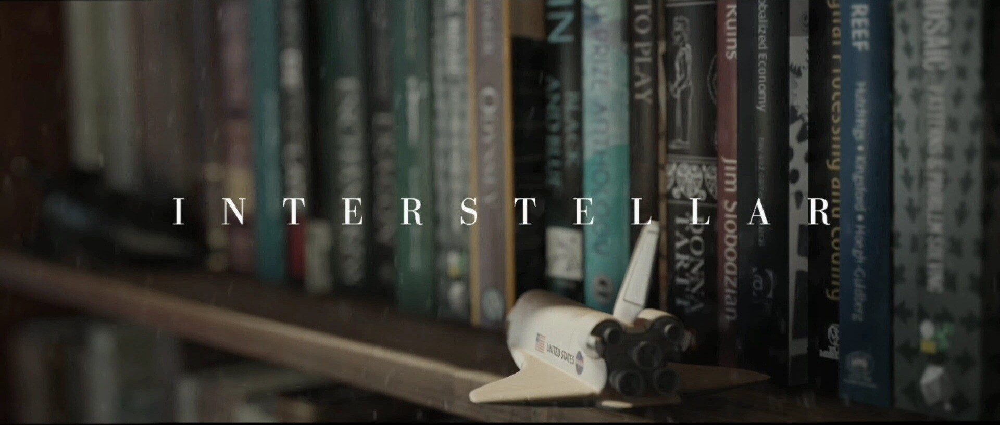

# Aayushi's World of Books :books: :sparkles:

- [About This Project](#about-this-project)
- [Motivation](#motivation)
- [My Actual Bookshelf](#my-actual-bookshelf)

## About This Project

I have always been a voracious reader, and will read anything in sight. Over the years, I have read a plethora of books, and it recently occurred to me that it would be nice to have records of everything I've read. This app is the result, and the hope is to catalogue and keep track of all the books I've read, and graphically show simple statistics and charts about my reading habits.

## Motivation

One of my earliest memories of trying to cultivate a personal library is when I was 6 and I started putting all my books into a box and creating custom library cards to stick at the back of the book to keep track of when my little sister took my books to play with. That system tragically did not work, but I continued to amass more books as the years went by. I lost a lot of my childhood books during several house moves, but am now beginning to rebuild my personal library. As of September 2023, I have close to 75 physical books on my bookshelf, but it is my deepest ambition to have a large personal library. This app is my attempt at recording metadata about books I own physically, digitally, and which I've borrowed.

One of my motivations is Murph's bookshelf in Interstellar (2014), which played a key role in the movie and kind of saved the universe. I don't think my bookshelf can do that, but one can dream.

## My Actual Bookshelf

Photo of my actual bookshelf coming soon!
